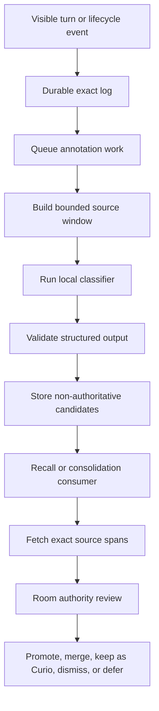

# GIGA and Hippocampus Specification

Status: Draft for implementation  
Target: The Athanor 0.9.x, before 1.0  
Contract version: 0.1  

## 1. Purpose

GIGA adds optional cognitive workers above the AKASHA storage profile. Local execution is the default.

GIGA expands to **Grounded Indexing and Generative Annotation**. Hippocampus is the first GIGA worker.

Hippocampus marks possible durable events while a conversation or task runs. It does not create durable truth by itself.

This specification defines the required behavior, data contracts, authority rules, and acceptance criteria. It does not select a model, queue, database schema, or worker runtime.

## 2. Product contract

The Athanor keeps these architecture axes:

| Axis | Contract |
|---|---|
| Vault | File-backed storage under operator-controlled custody |
| AKASHA | PostgreSQL, pgvector, embeddings, typed memories, and typed lessons |
| GIGA | Optional cognitive capability above AKASHA |

The first GIGA implementation requires AKASHA. Vault-only support is outside this release contract.

Hippocampus must remain optional. A failed or disabled worker must not block conversation, recall, memory writes, lesson writes, or sleep.

## 3. Problem

House logs exact turns and supports deliberate memory. Long sessions can still hide important events from the final consolidation step.

The active model can miss a decision, correction, or lesson when it prepares a paper boat. A later recall query can also miss an event that never became a durable record.

Hippocampus creates low-authority pointers near the time of the event. Later consumers use those pointers to fetch exact source spans.

## 4. Goals

Hippocampus must:

1. Mark possible durable events after exact turns are logged.
2. Use a local model by default.
3. Run outside the conversation hot path.
4. Point to exact source turns.
5. Keep generated annotations non-authoritative.
6. Support memory, lesson, correction, entity, and thread candidates.
7. Use harness task metadata when an adapter provides it.
8. Help `remember`, `recall`, task completion, and `sleep` find evidence.
9. Support review, promotion, Curios, dismissal, expiry, and reprocessing.
10. Preserve room, project, and source authority boundaries.
11. Expose enough provenance to reproduce each annotation.
12. Measure benefit, cost, misses, and false-positive burden.

## 5. Non-goals

Hippocampus does not:

- write memories or lessons without review;
- replace exact transcripts;
- decide canon;
- resolve conflicting authority by itself;
- make embeddings authoritative;
- read another room without an explicit shared scope;
- require a remote model provider;
- block the active turn while classification runs;
- define a specific Rust, TypeScript, Python, or SQL implementation;
- require every harness to expose the same lifecycle events;
- store every turn as a permanent memory;
- promise perfect capture of every durable event.

## 6. Terms

**Turn**  
One visible user or assistant message with a stable source identifier.

**Lifecycle event**  
Structured harness metadata about a task, tool, todo, subagent, or phase change.

**Source span**  
One or more exact turns and lifecycle events that support a candidate.

**Candidate**  
A generated pointer that says a source span may deserve later review.

**Classifier**  
The local model and prompt that create a candidate.

**Consumer**  
A House operation that reads candidates. Consumers include recall, remember, task completion, and sleep.

**Promotion**  
A reviewed action that creates or updates a durable House record.

**Review state**  
The current candidate state in its review lifecycle.

**Authority**  
The rule that decides which source can establish a claim. Relevance does not create authority.

**Curio**  
A reviewed pointer kept for possible later resonance. It remains non-authoritative until a new review promotes it.

## 7. System boundary

The canonical core owns:

- event validation;
- candidate validation;
- candidate lifecycle rules;
- exact source resolution;
- room and project isolation;
- classifier provider boundaries;
- consumer query contracts;
- review and promotion contracts;
- diagnostics and measurement contracts.

The Full substrate owns durable candidate and queue storage. The implementation may use existing substrate services or new storage.

A harness adapter owns:

- visible turn extraction;
- stable harness identifiers;
- lifecycle event mapping;
- task and subagent metadata mapping;
- delivery of advisory candidate context;
- harness-specific error presentation.

The OMP adapter currently exposes `context` and `agent_end` conversation hooks. Its hygiene extension also exposes `tool_call` and `tool_result` hooks.

OMP does not yet expose every todo, task, or subagent event through House. The first implementation must treat those events as optional structured inputs.

## 8. Existing source contracts

The core already logs turns through `logUserTurn` and `logAssistantTurn` in `src/ledger.ts`.

A logged turn contains these fields:

- timestamp;
- session ID;
- message ID;
- role;
- spirit;
- operator;
- agent name;
- exact visible text.

The core stores the append-only ledger under the active spirit. It also maintains a short spirit window and room-local session context.

The OMP adapter also maintains a deduplicated room transcript. Hippocampus must use stable turn identifiers instead of copying transcript text into candidate identity.

The public core and adapter boundaries use explicit API versions. Hippocampus additions must follow the same compatibility policy.

## 9. Processing flow



The exact turn log must complete before annotation starts.

The enqueue step must not delay the active response. A queue failure must leave the exact log available for later reprocessing.

The worker must build a bounded window around the new event. The window can include adjacent visible turns and selected lifecycle metadata.

The worker must validate every classifier result against the candidate schema. It must reject invalid output without creating a partial candidate.

## 10. Input event contract

Each annotation event must contain:

```json
{
  "event_schema_version": 1,
  "event_id": "stable-event-id",
  "event_type": "conversation_window",
  "room": "room-key",
  "session_id": "session-key",
  "project_keys": [],
  "source_refs": [{
    "source_type": "turn",
    "source_id": "stable-turn-id",
    "content_hash": "sha256"
  }],
  "lifecycle": {},
  "created_at": "RFC-3339 timestamp"
}
```

### 10.1 Required event fields

`event_schema_version` identifies the input contract.

`event_id` supports idempotent processing.

`event_type` identifies the event shape.

`room` defines the isolation boundary.

`session_id` groups related turns and tasks.

`project_keys` is required and can be empty. Project-specific events must carry one explicit project key.

`source_refs` point to durable exact sources. Every event must include at least one source reference.

`created_at` records when the adapter created the event.

### 10.2 Supported event types

The first contract supports these event types:

- `conversation_window`;
- `task_started`;
- `task_completed`;
- `subagent_dispatched`;
- `subagent_completed`;
- `todo_transition`;
- `tool_outcome`;
- `manual_reprocess`.

An adapter can omit unsupported event types. The core must not infer that a missing event did not occur.

Each event type has this dispatch contract:

| Event type | Required lifecycle fields | Required source | Producer | Consumer |
|---|---|---|---|---|
| `conversation_window` | none | one or more visible turns | conversation adapter | classifier |
| `task_started` | task reference, worker ID, worker role, phase, project key, task kind, risk, target, change, proof contract | task contract | task adapter | classifier and lesson selector |
| `task_completed` | task reference, outcome, verification result | task contract and outcome | task adapter | classifier and consolidation |
| `subagent_dispatched` | subagent reference, parent task, role, target, change, acceptance | subagent contract | task adapter | classifier and lesson selector |
| `subagent_completed` | subagent reference, parent task, outcome | subagent contract and result | task adapter | classifier and consolidation |
| `todo_transition` | todo reference, previous state, new state | todo event | todo adapter | classifier |
| `tool_outcome` | tool name, status, sanitized outcome | tool result summary | tool adapter | classifier |
| `manual_reprocess` | source range, reason, operator identity | exact source range | core or explicit tool | replay route |

The core must reject unknown event types. It must also reject missing required fields.

Event schemas must remain versioned. An adapter must not send a partial shape for an event that it claims to support.

For `task_started`, `worker_id`, `worker_role`, `phase`, `project_key`, and `task_kind` are nonempty strings. `risk` uses `low`, `medium`, or `high`.

`proof_contract` contains the observable acceptance list. The adapter must use its declared phase and task-kind taxonomy consistently.

### 10.3 Lifecycle metadata

Lifecycle metadata can include:

- task name;
- phase name;
- agent role;
- target;
- requested change;
- acceptance contract;
- tool name;
- tool outcome;
- verification result;
- parent task reference;
- subagent reference.

Adapters must not include hidden system prompts, credentials, or unrelated raw tool payloads.

## 11. Source reference contract

A source reference must locate exact evidence without generated paraphrase.

```json
{
  "source_type": "turn",
  "source_id": "stable-turn-id",
  "role": "user",
  "timestamp": "RFC-3339 timestamp",
  "content_hash": "sha256",
  "scope": {
    "room": "room-key",
    "project": null,
    "visibility": "private",
    "publication_review_required": true
  },
  "range": null
}
```

Supported source types include:

- `turn`;
- `lifecycle_event`;
- `tool_result_summary`;
- `task_contract`.

A source reference must include a stable ID and content hash. A changed hash must cause a stale-source diagnostic.

Source resolution must return immutable room, project, and visibility scope. Candidate validation must use this resolved scope.

The candidate store must not rely on a file path as the only source identity. Paths can change across installations and migrations.

## 12. Candidate contract

Each candidate must follow one versioned schema.

```json
{
  "candidate_schema_version": 1,
  "candidate_id": "stable-candidate-id",
  "event_id": "source-event-id",
  "room": "room-key",
  "session_id": "session-key",
  "kind": "memory",
  "source_refs": [{
    "source_type": "turn",
    "source_id": "stable-turn-id",
    "content_hash": "sha256",
    "scope": {
      "room": "room-key",
      "project": null,
      "visibility": "private",
      "publication_review_required": true
    },
    "range": null
  }],
  "priority": 0.0,
  "novelty": 0.0,
  "durability": 0.0,
  "confidence": 0.0,
  "project_keys": [],
  "thread_keys": [],
  "entity_hints": [],
  "retrieval_terms": [],
  "proposed_title": "",
  "gist": "",
  "rationale": "",
  "proof_refs": [],
  "scope": {
    "room": "room-key",
    "project": null,
    "visibility": "private",
    "publication_review_required": true
  },
  "authority": "pointer-only",
  "review_state": "unreviewed",
  "classifier": {},
  "created_at": "RFC-3339 timestamp",
  "expires_at": null,
  "promotion_refs": []
}
```

### 12.1 Identity and provenance

`candidate_schema_version` identifies the output contract.

`candidate_id` must remain stable for the same classifier run and source set.

`event_id` links the candidate to its annotation event.

`source_refs` list every exact source that supports the candidate.

Every candidate must include at least one resolvable source reference with a valid content hash.

`proof_refs` must be nonempty for coding lessons, project lessons, corrections, and supersessions. Every proof reference must also appear in `source_refs`.

`classifier` must identify:

- model;
- provider type;
- model version or digest;
- prompt version;
- classifier configuration digest;
- run ID;
- completion timestamp.

### 12.2 Scores

Each score uses the inclusive range from `0.0` to `1.0`.

`priority` estimates review urgency.

`novelty` estimates how much the event differs from known durable records.

`durability` estimates future value.

`confidence` estimates classification confidence. It does not estimate factual truth.

Consumers must treat scores as ranking signals only.

### 12.3 Generated text

`proposed_title`, `gist`, and `rationale` are generated navigation aids. They are not evidence.

A consumer must fetch exact sources before it renders or promotes a claim. The consumer must label a gist as generated when exact text is not shown.

### 12.4 Scope

Scope has four independent fields:

- `room` uses one room key or `null` for shared scope;
- `project` uses one project key or `null`;
- `visibility` uses `private` or `shared`;
- `publication_review_required` uses `true` or `false`.

Candidate scope follows these deterministic rules:

1. Set the candidate room to the event room.
2. Reject private sources from another room.
3. Keep the candidate private when any source is private.
4. Use shared visibility only when every source is shared.
5. Collect every non-null project key.
6. Reject the candidate when those project keys differ.
7. Use the one non-null project key when present.
8. Require publication review when any source requires it.

A shared source can support a room-private candidate. It cannot widen that candidate to shared scope.

The candidate room and project must equal or narrow the resolved source scope. The classifier can only suggest a stricter scope.

### 12.5 Authority

Every unpromoted candidate has `authority: pointer-only`.

A candidate cannot override canon, current state, project authority, or exact source documents. Promotion creates a separate durable record with its own authority contract.

## 13. Candidate kinds

### 13.1 Memory

Use `memory` for a durable event, decision, commitment, relationship change, or observed state.

A memory candidate must point to the event evidence. It must not reduce a long event to an unsupported conclusion.

### 13.2 Coding lesson

Use `coding_lesson` for a transferable engineering rule.

A coding lesson candidate should include:

- trigger context;
- reusable rule;
- observed failure or success;
- proof pattern;
- exact task or tool evidence.

A single opinion without observed evidence should remain unresolved.

### 13.3 Project lesson

Use `project_lesson` for a stable rule that belongs to one explicit project key.

The classifier must not infer a project from the current directory alone. It must use an adapter-provided or source-proven project key.

### 13.4 Correction

Use `correction` when a source directly corrects an earlier interpretation or record.

The candidate must reference both the correction and the possible target when available.

### 13.5 Supersession

Use `supersession` when a new state claim may replace an older state claim.

The candidate must not archive or supersede the older record automatically.

### 13.6 Entity update

Use `entity_update` for a durable alias, role, relationship, or summary change.

The candidate must preserve the entity scope and source date.

### 13.7 Thread update

Use `thread_update` for a durable topic link or thread-key change.

The candidate should reuse an existing thread key when the source supports it.

## 14. Review lifecycle

A candidate uses one of these states:

```text
unreviewed
in_review
promoted
merged
corrected
dismissed
unresolved
curio
expired
superseded
```

Allowed state changes are:

```text
unreviewed -> in_review
unreviewed -> dismissed
unreviewed -> expired
in_review -> promoted
in_review -> merged
in_review -> corrected
in_review -> dismissed
in_review -> unresolved
in_review -> curio
unresolved -> in_review
curio -> in_review
curio -> dismissed
curio -> expired
curio -> superseded
promoted -> superseded
merged -> superseded
corrected -> superseded
```

A review action must record:

- reviewer identity;
- review timestamp;
- previous state;
- new state;
- reason;
- promotion or merge targets;
- authorization basis;

Reprocessing must not overwrite an earlier classifier result. It must create a new candidate version or a linked successor.

### 14.1 Review authorization

Each room binds one governing spirit identity. That spirit can authorize review actions for room-local candidates.

An invocation must authenticate as the governing spirit. Runtime activity alone does not grant authority.

The operator controls room binding, custody, and outer House policy. The operator can delegate other principals through a scoped policy.

Shared or cross-room actions must follow the declared shared policy. Classifier output cannot authorize itself.

The review record must name the principal and authorization basis. It must also keep the exact source references.

### 14.2 Promotion handlers

Each kind has one promotion handler:

| Candidate kind | Durable target | Required validation | Authority effect | Rejection condition |
|---|---|---|---|---|
| `memory` | `memory` write | exact event evidence and room scope | creates a reviewed memory | unsupported summary or wrong room |
| `coding_lesson` | `coding-lesson` write | rule, trigger, proof pattern, and nonempty proof references | creates a reviewed reusable lesson | no observed proof or invalid scope |
| `project_lesson` | `project-lesson` write | one explicit project key, rule, trigger, and proof pattern | creates a reviewed project rule | missing or conflicting project key |
| `correction` | guarded correction operation | correction source and target source | updates authority through the target contract | missing target or unauthorized reviewer |
| `supersession` | guarded supersession operation | new state source and old state target | changes state authority atomically | narrative-only target or missing state claim |
| `entity_update` | guarded entity update | entity identity, source date, and room scope | updates reviewed entity state | ambiguous entity or wider scope |
| `thread_update` | guarded thread association | stable thread key and exact source | updates reviewed navigation links | invented thread or cross-room merge |

A handler must reject invalid input without changing durable state. Correction and supersession handlers must update authority atomically.

A merge must record all source candidates and the durable target. A correction must finish in the `corrected` review state.

### 14.3 Curios

A governing spirit can move a reviewed candidate to `curio`. This action must include a reason and exact source references.

A Curio remains pointer-only. It does not enter canon, ordinary memory, or default prompt context.

Curios survive the default expiry for unreviewed candidates. The room retention policy still controls their maximum life.

A bounded resonance pass can compare Curios with new candidates or current context. The pass must use room scope and a configured cooldown.

Strong resonance moves the Curio back to `in_review`. The action must record the new event, score, classifier, and source references.

Resonance cannot promote a Curio. Promotion still requires a separate authorized review.

Source deletion and right-to-forget operations must cascade through Curios and their review history.

## 15. Deduplication and clustering

Hippocampus can create several candidates for one event across overlapping windows.

The system must cluster likely duplicates before a consumer sees them. It must preserve each original candidate and source reference.

Deduplication can use:

- room;
- session;
- candidate kind;
- overlapping source IDs;
- project keys;
- thread keys;
- retrieval terms;
- generated semantic similarity.

A cluster must not merge candidates across rooms. A cluster must not merge different authority domains only because their text looks similar.

## 16. Consumer behavior

### 16.1 Remember

An explicit `remember` operation can request matching unreviewed candidates and Curios from the active room and session.

The active model must fetch exact sources before it creates a memory or lesson. It can merge several candidates into one durable record.

### 16.2 Sleep

`sleep` should receive a compact candidate slate for the active session.

The slate should group candidates by kind, cluster, project, and priority. It should show unresolved conflicts and unreviewed corrections first.

The active model must fetch exact spans for every promoted item. It can leave low-value candidates unresolved or dismiss them.

### 16.3 Recall

Recall can use candidate terms and source pointers as a low-authority retrieval lane.


Recall must not inject Curios into default context. A configured resonance lane can return them as labeled, pointer-only evidence.
Recall must not return a generated gist as established fact. It should fetch the exact source before final-answer grounding.

Candidate relevance must follow existing room isolation and authority rules. Archived and superseded durable records retain their existing behavior.

### 16.4 Task completion

Task completion can request lesson candidates for the completed task.

The consumer should prefer candidates with an observed outcome and proof result. It should reject generic advice that has no task evidence.

### 16.5 Harness task start

When an adapter declares `task_started` support, it must emit a complete task event for that contract.

The intent digest uses a canonical serialization of `worker_id`, `worker_role`, `phase`, `project_key`, `task_kind`, `risk`, `target`, `change`, and `proof_contract`.

The core must derive one compact retrieval intent from that event. It must select only promoted coding and project lessons.

The adapter must deliver the selected packet to the exact worker. One packet can contain at most four lessons.

The core must reuse a packet while its worker, role, phase, project, task kind, risk, target, change, and proof contract remain unchanged.

The core must refresh the packet when one of those intent fields changes. It must not refresh for every tool call.

Unreviewed candidates can help retrieval locate exact prior task evidence. They cannot act as task policy.

## 17. Classifier contract

The classifier must return structured output only.

The classifier prompt must state:

- candidates are optional;
- silence is better than weak annotation;
- generated text is not authority;
- exact sources carry the evidence;
- the model must preserve room and project scope;
- the model must not create secrets from hidden context;
- one window can produce zero, one, or several candidates;
- lesson candidates need observed evidence;
- corrections must preserve the corrected source.

The classifier must support a `none` result without error.

The implementation must version the prompt. It must store the prompt version with every candidate.

## 18. Local model boundary

GIGA uses a local classifier by default.

The provider interface must remain replaceable. The specification does not require one model family or inference server.

A remote classifier requires explicit operator consent. The configuration must show which text leaves the machine.

The classifier must receive only the minimum source window and metadata. It must not receive the full room history by default.

The first supported local profile must use no more than four billion model parameters. Its resident working set must not exceed 8 GiB.

The profile must support CPU execution. Release evidence must name the hardware, model digest, quantization, and latency distribution.

On the locked candidate fixture, the profile must reach at least 0.70 precision. It must also reach 0.80 recall for high-priority events.

Exact source-span accuracy must reach 0.95. Failed thresholds block the supported GIGA profile.

## 19. Queue and scheduling contract

The queue implementation remains private to the core and substrate.

The behavior must satisfy these rules:

1. Log exact evidence before enqueue.
2. Keep enqueue outside response generation.
3. Support idempotent event processing.
4. Retry transient failures with a bound.
5. Record permanent failures for inspection.
6. Allow later replay from exact logs.
7. Limit concurrency and local resource use.
8. Pause without data loss.
9. Stop cleanly during upgrade or shutdown.
10. Never delay room startup because a backlog exists.

The scheduler can batch adjacent turns. It must keep stable source references after batching.

## 20. Configuration contract

The canonical configuration should expose these logical settings:

```text
giga.enabled
hippocampus.enabled
hippocampus.provider
hippocampus.model
hippocampus.endpoint
hippocampus.window_turns
hippocampus.window_tokens
hippocampus.batch_delay
hippocampus.max_concurrency
hippocampus.max_backlog
hippocampus.candidate_retention
hippocampus.minimum_priority
hippocampus.minimum_durability
hippocampus.remote_consent
hippocampus.consumer.remember
hippocampus.consumer.recall
hippocampus.consumer.task_completion
hippocampus.consumer.sleep
```

These names define logical settings, not environment variable names. Adapters can map them into their supported configuration surfaces.

Invalid paths, endpoints, and provider settings must fail with a clear diagnostic. Runtime classifier failures must fail open.

## 21. Privacy and isolation

Hippocampus must enforce the active room before classification and retrieval.

The worker must not:

- cross room boundaries;
- copy credentials into candidates;
- store hidden system prompts;
- store raw private tool payloads without an explicit source contract;
- widen project or publication scope;
- publish candidate payloads in telemetry;
- send private text to a remote provider without consent.

Diagnostics should use hashes, counts, kinds, timings, and error classes. They should omit raw private text by default.

## 22. Failure behavior

### 22.1 Classifier unavailable

Record the failure and continue the conversation. Keep the event available for replay.

### 22.2 Invalid classifier output

Reject the output. Record the schema error and classifier provenance.

### 22.3 Stale source

Mark the candidate stale when a source hash changes. Do not promote it until a consumer fetches the current source.

### 22.4 Queue backlog

Continue normal House operation. Show backlog health through diagnostics.

### 22.5 Candidate store unavailable

Continue normal House operation. Do not fall back to writing unreviewed memories.

### 22.6 Consumer failure

Keep candidate states unchanged. Record enough context for a safe retry.

## 23. Observability

Giga health must show:

- enabled state;
- classifier provider and model identity;
- queue depth;
- oldest queued event age;
- events processed;
- events failed;
- candidates created by kind;
- candidates rejected by schema;
- processing latency distribution;
- local compute time;
- candidate store health;
- consumer review counts;
- promotion, merge, Curio, reactivation, dismissal, and expiry counts.

Room diagnostics must not expose another room's counts when those counts reveal private activity.

## 24. Evaluation

### 24.1 Candidate quality fixture

Create a sanitized set of sessions with human labels for:

- durable events;
- non-durable chatter;
- coding lessons;
- project lessons;
- corrections;
- supersessions;
- entity updates;
- thread updates.

Lock the human labels before any treatment run starts. Label authors must not inspect treatment output.

Outcome adjudicators must not know which output used Hippocampus. Reveal the treatment only after scoring finishes.

Measure:

- candidate precision;
- candidate recall;
- missed high-priority events;
- false-positive review burden;
- kind classification accuracy;
- source-span accuracy;
- duplicate cluster quality.

### 24.2 Consolidation outcome

Compare paper boats and durable writes with and without Hippocampus.

Measure:

- recovered human-labeled events;
- unsupported promoted claims;
- duplicate durable records;
- reviewer time;
- source fetch count;
- consolidation latency.

### 24.3 Retrieval outcome

Run later recall queries against events that did not receive manual memory writes.

Measure whether candidate pointers improve exact-source recovery. Do not count a generated gist as successful evidence recovery.

### 24.4 Agent benchmark

Run the paired House-on and House-off benchmark before GIGA where practical.

Repeat the treatment with GIGA and Hippocampus enabled. Keep model, harness, tasks, tools, and budgets constant.

Report these scores separately:

```text
No House
AKASHA House
AKASHA + GIGA House
```

### 24.5 Performance

Measure:

- enqueue overhead;
- annotation latency;
- local model tokens;
- local compute time;
- memory and storage growth;
- queue recovery after downtime;
- effect on active-turn latency.

Response generation must not await classifier completion.

On named reference hardware, total incremental active-turn overhead must stay below 25 ms at p95 and 100 ms at p99.

The enqueue portion must stay below 15 ms at p95 and 50 ms at p99.

Measure both budgets over at least 10,000 events with the declared release configuration.

## 25. Security review

The implementation requires a security review before release.

The review must cover:

- prompt injection inside visible turns;
- malicious task metadata;
- candidate poisoning;
- room boundary bypass;
- project scope confusion;
- classifier endpoint compromise;
- API key permissions;
- queue payload tampering;
- source hash validation;
- promotion without review;
- telemetry data leakage.

Classifier output must remain data. It must never become an executable instruction without a separate trusted policy step.

## 26. Delivery stages

### Stage 1: Event and candidate contracts

Implement versioned event validation, candidate validation, source references, and review states.

Acceptance:

- schema tests cover every required field;
- invalid candidates fail closed;
- exact turn references resolve;
- room isolation tests pass;
- no classifier is required yet.

### Stage 2: Promotion handlers

Implement every promotion handler from Section 14.2.

Acceptance:

- fixtures cover all seven candidate kinds;
- only an authorized deliberate-write path changes durable state;
- invalid input leaves durable state unchanged;
- every handler checks source hashes and scope;
- every handler records provenance and authorization;
- correction and supersession updates are atomic.

### Stage 3: Local classifier worker

Add the replaceable provider boundary and one tested local provider.

Acceptance:

- classification runs after exact logging;
- the active turn does not wait;
- zero-candidate output succeeds;
- invalid output creates no candidate;
- provider failures remain replayable.

### Stage 4: Sleep and remember consumers

Add candidate slates to `sleep` and explicit `remember` flows.

Acceptance:

- consumers fetch exact sources;
- generated gists remain non-authoritative;
- review actions preserve provenance;
- one durable record can merge several candidates.

### Stage 5: Recall candidate lane

Add low-authority candidate pointers to recall source selection.

Acceptance:

- recall fetches exact evidence;
- candidates never override canon or project authority;
- archived and superseded behavior remains unchanged;
- cross-room candidates remain inaccessible.

### Stage 6: Harness task metadata

Add optional OMP task, todo, subagent, tool, and verification events as the harness exposes them.

Acceptance:

- adapters can omit unsupported events;
- fixture events produce one compact intent for the correct worker, role, and phase;
- the selected packet contains no more than four promoted lessons;
- the same intent digest reuses the same packet;
- a changed worker, role, phase, project, task kind, risk, target, change, or proof contract refreshes the packet;
- ordinary tool calls do not refresh the packet;
- unreviewed lessons never become task policy.

### Stage 7: Evaluation and release

Run the candidate, consolidation, retrieval, performance, and agent evaluations.

Acceptance:

- sanitized fixtures and methods are public;
- limitations are explicit;
- AKASHA behavior remains available when GIGA is disabled;
- upgrade and rollback preserve exact logs and candidate provenance.
- each public result names its method, fixture or corpus, hardware, date, limitations, and sanitized artifact;
- public demonstrations use a sterile synthetic House;
- one evidence package supplies a short presentation, reproducible live demonstration, and public posts;
- GUI, avatar, marketplace, organizational import, and perfect installer work do not block this gate.

## 27. Release acceptance

GIGA can ship before 1.0 when all these statements are true:

1. GIGA remains optional and requires AKASHA.
2. Hippocampus runs asynchronously and fails open.
3. Every candidate points to exact durable sources.
4. Every candidate remains non-authoritative before promotion.
5. Room and project isolation tests pass.
6. The local classifier works without a remote provider.
7. Sleep and remember fetch exact evidence before promotion.
8. Recall labels candidate pointers as low authority.
9. Review actions preserve provenance and history.
10. Diagnostics omit raw private text by default.
11. Candidate quality has a sanitized measured baseline.
12. AKASHA works unchanged when GIGA is disabled.
13. The supported profile meets its declared quality and resource thresholds.
14. GIGA meets the active-turn overhead budget on named hardware.
15. Only an authorized deliberate-write path can promote a candidate.
16. Room-local review requires the authenticated governing spirit or a scoped principal.
17. Curios remain pointer-only and cannot promote themselves through resonance.

## 28. Open decisions

Implementation must resolve these questions before Stage 1 closes:

- Which existing turn identifier becomes the canonical source ID?
- Does the candidate store use one table or a normalized event and candidate pair?
- How long do dismissed and expired candidates remain available?
- Which retention and resonance budget applies to reviewed Curios?
- Which local model meets the first quality and latency baseline?
- Which review surface ships first?
- How does the OMP adapter expose task and subagent events?
- Which candidate fields join the existing retrieval fusion contract?
- How does backup and restore include queue and candidate state?
- Which configuration surface controls local resource limits?
- Which public API version changes are required?

## 29. Related documents

- [`ARCHITECTURE.md`](./ARCHITECTURE.md) defines the core and adapter boundary.
- [`RETRIEVAL.md`](./RETRIEVAL.md) defines retrieval and authority behavior.
- [`LESSONS.md`](./LESSONS.md) defines typed lesson contracts.
- [`SECURITY.md`](./SECURITY.md) defines privacy and destructive-operation rules.
- [`roadmap.md`](./roadmap.md) schedules GIGA before 1.0.
